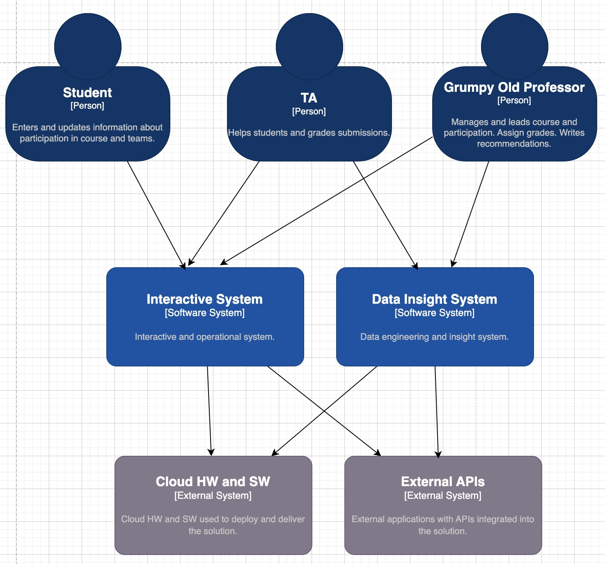
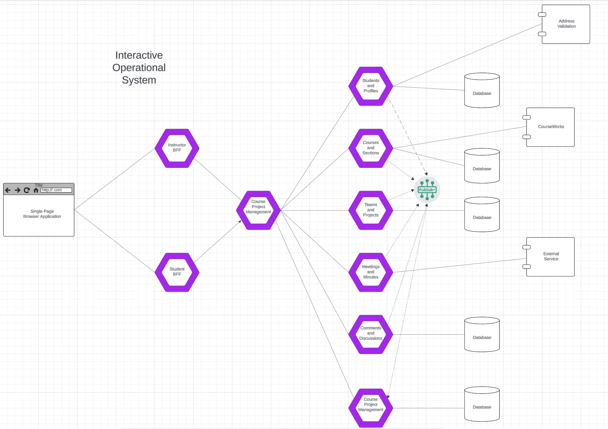

# Grumpy Old Professor's Course Management System

## Introduction

This is the documentation, explanation, community, etc. repository for the
Grumpy Old Professor's Course Management System. The GitHub Project
[Grumpy Old Professor's Course Management System](https://github.com/users/donald-f-ferguson/projects/9)
is the coordinating GitHub project.

## Course Management System Overview

|  |
|:---------------------------------:|
|        __System Overview__        |

There are two major subsystems in the overall system:
1. The _interactive system_ is a set of microservices and web UIs that enable students, 
TAs, instructors, etc. to read and update information, and accomplish tasks.
2. The _data insight system_ enables the instructor and TA to analyze data, create reports, etc.

The system in cloud based and relies on a set of cloud application and infrastructure.

|  |
|:------------------------------------:|
|         __System Overview__          |

Several microservices and web UIs make up the interactive systems:
- Students and profiles manages basic student information.
- Courses and sections manages information about courses, sections of courses
and enrollments in courses. This microservice relies on a CourseWorks adaptor (not shown)
the provides read access to CourseWorks data.
- Teams and projects manages teams and students' participation in teams, and associated
presentations, documents, etc.
- Meetings and minutes enables meeting scheduling, recording attendance and documenting
minutes and actions.
- Comments and discussions enables thread discussions related to meetings, projects, etc.
- Course project management is a composites microservice that integrates the base services
into an overall system.
- There are two backends-for-frontends that adapt the APIs to the specific users and roles.
- There is a single page web application project that provides the user interface.

